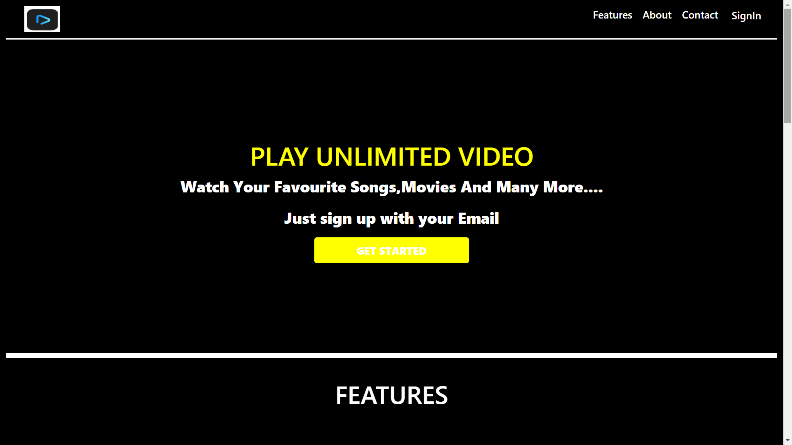
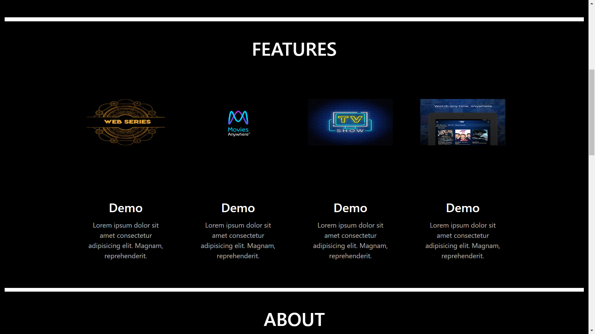
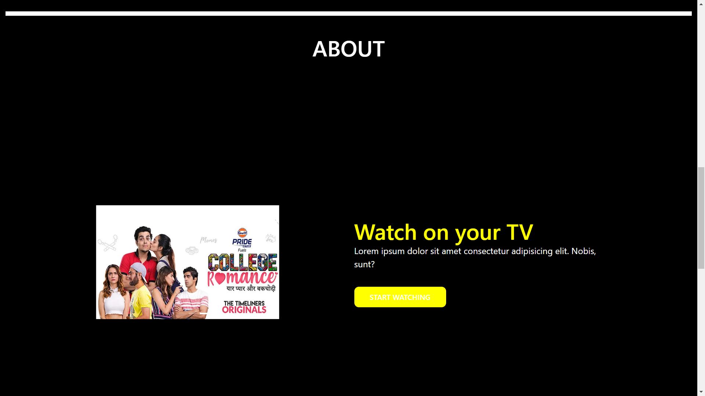
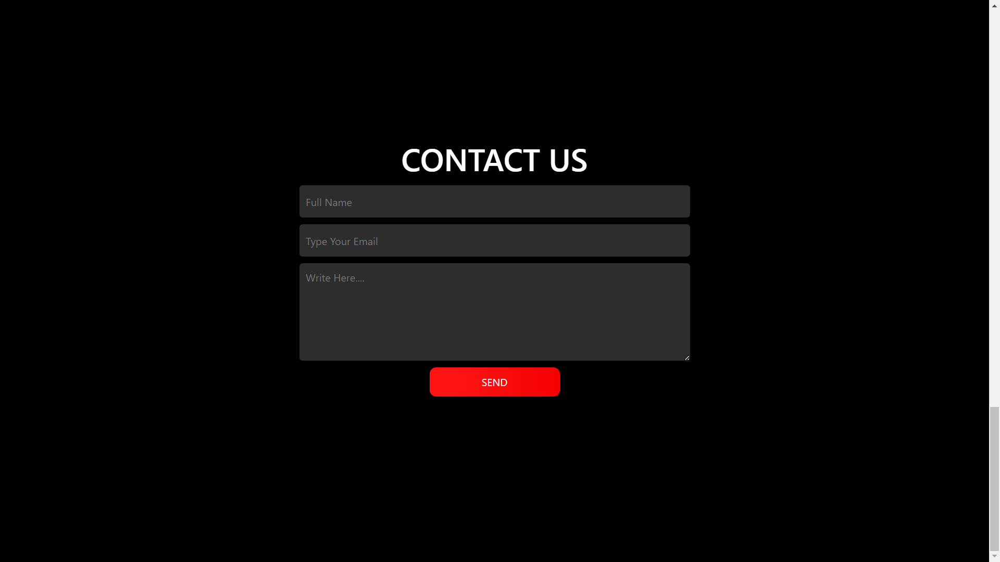
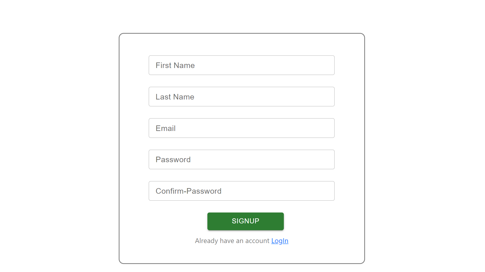
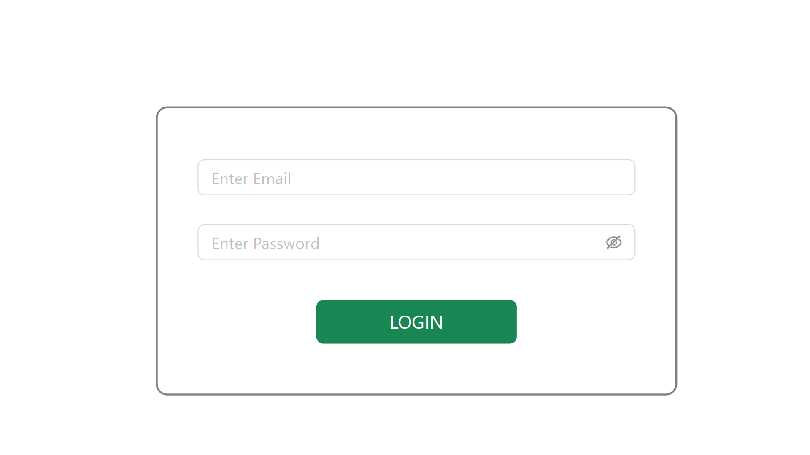
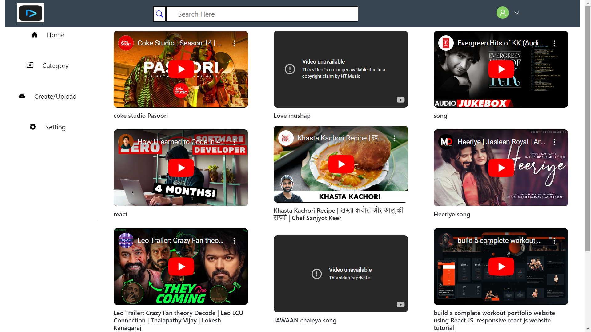

Explore a seamless video streaming experience with the Video Player App! This repository features a user-friendly landing page, secure sign-in/sign-up powered by MongoDB, and a dynamic home page showcasing an extensive video collection. The app incorporates validation, search, upload, and sign-out functionalities for a comprehensive user experience.
  

    <h3>##Landing Page</h3>
    
    
    
    
    

    

    <h3>## Sign Up Page</h3>
    
    

    

    <h3>## Sign In Page</h3>
    
    

    

    <h3>## Home Page</h3>
    
    

